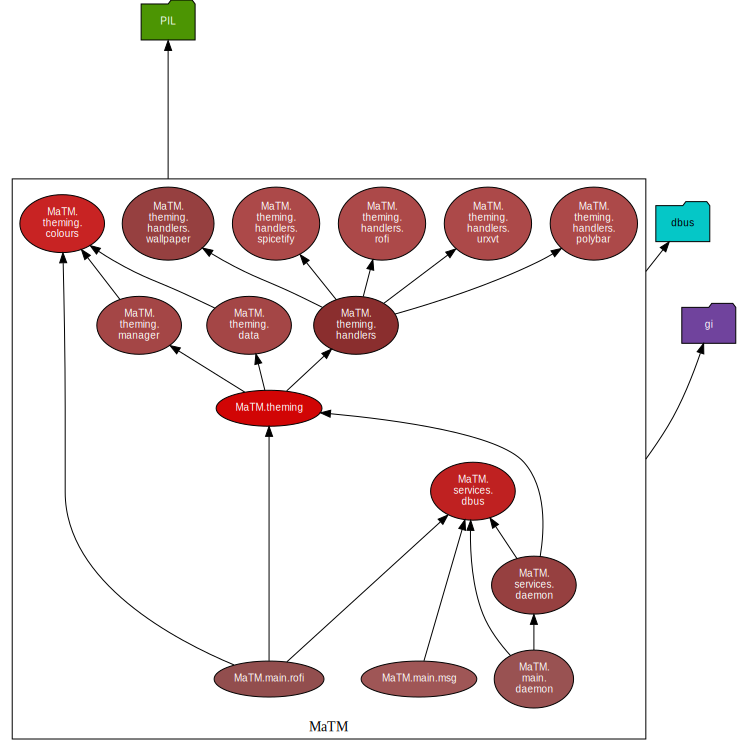

# Multi Application Theme Manager (MaTM)
MaTM is used to apply a consistent theme to multiple X11 applications at once

Support for more applications will be added in the future when the base of MaTM is complete

## Application support
- [ ] Rofi
- [ ] Polybar
- [ ] Wallpaper
- [ ] Urxvt
- [ ] Spotify [via [spicetify](https://github.com/khanhas/spicetify-cli)]

## Dependency Graph

